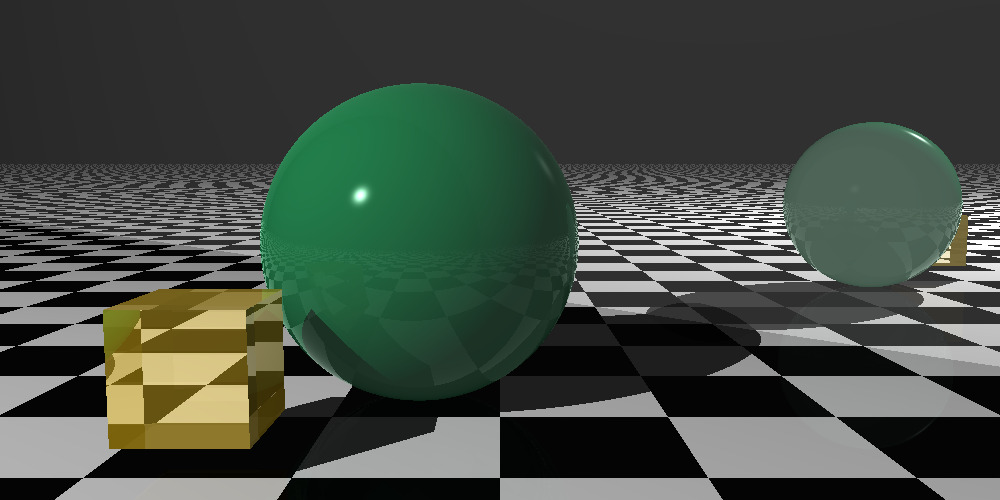

# Ray Tracer

## Introduction

Simple Ray Tracer implementation written in Rust.

The goal of the project is to learn/explore Rust, its ecosystem, and develop something new, complex and fun.

## Getting Started

### Tests

Each component of the project is fully covered with unit tests. To run tests:

- `cargo test` to run tests

### Build

Use one of the following commands to build:

- `cargo build` - debug target
- `cargo build --release` - release target

### Run

- `cargo run --release` - run release target. Current implementation generates `.ppm` files. They can be opened with default tools on MacOS. I have not tested it on other platforms yet.

### TODO

- More RT related stuff:
  - More geometries: cubes, triangles, cylinders. Generalisation.
  - Complex/Solid geometries support
  - OBJ files
- CLI
- Parallel implementation w/ Rayen